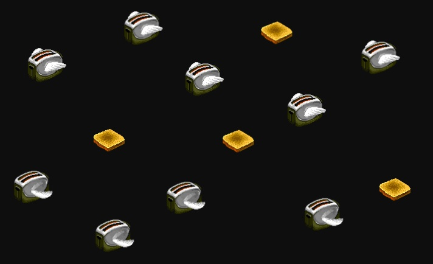

# After Dark in CSS

Do you longingly reminisce about the days when flying toasters graced your screen? Do words like "Confetti Factory" and "Daredevil Dan" make your heart skip a beat?

If so, then never fear—CSS is here! Using modern CSS techniques like animations and transforms, we can imitate several of your favorite After Dark™ screensavers.

The animations were made with CSS alone. No animated gifs or JavaScript.

**[See them here!](http://bryanbraun.github.io/after-dark-css/)**

## Why?

Just for fun.

## License?

* The HTML & CSS is licensed with [The MIT License](https://opensource.org/licenses/MIT).
* The [ChicagoFLF font](https://usemodify.com/fonts/chicago/) is licensed with [The SIL Open Font License](https://scripts.sil.org/ofl).
* Images are copyright [Berkeley Systems](https://en.wikipedia.org/wiki/Berkeley_Systems).

Full reuse is probably ok, but use at your own risk! [For more details, see this comment](https://github.com/bryanbraun/after-dark-css/issues/3#issuecomment-127814083).

## Thanks to:

[Jonathon Sampson](https://twitter.com/jonathansampson), [Keith Clark](http://codepen.io/keithclark/), [Rob Glazebrook](http://www.cssnewbie.com/pure-css-bouncing-ball), [Ryan Justice](http://ned.highline.edu/~ryan-j/200/final/) and others for posting tutorials & demos on CSS animations.
[N. Landsteiner](http://www.masswerk.at/flyer/), [David Donarumo](http://www.youtube.com/watch?v=M1w1SQ3ezh8), and [Lazy Game Reviews](http://www.youtube.com/watch?v=ANnYbX54oU4) for online preservation of what the original screensavers looked like.
Robin Casady for the Public Domain [ChicagoFLF](http://christtrekker.users.sourceforge.net/fnt/chicago.shtml) font.
The original screensavers and artwork are © 1989 Berkeley Systems Inc.
